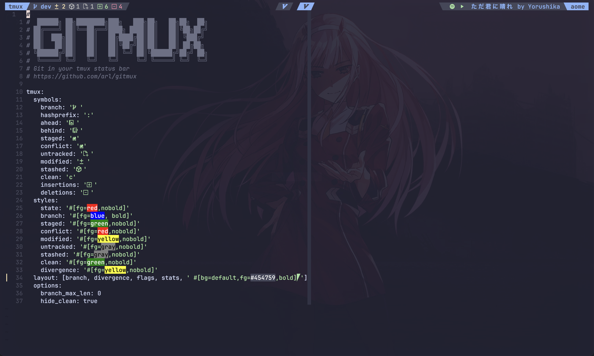
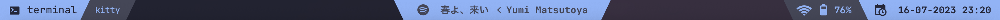

# CONFIG FILES

Configuration files for:
    - neovim
    - tmux
    - starship

Each of these configurations use [catppuccin](https://github.com/catppuccin) as
colorscheme pallette. Because I love the pastel tones that brings.

## Neovim

My personal editor configuration following the plugins setup from @theprimeagen,
who inspired me to use vim motions and love the neovim editor, as well as @teejdev,
who inspired me into plugin creation.

## Tmux

Learning tmux for a more productive way of using the terminal.

## Starship

My own custom prompt using [starship](https://starship.rs/)

## Sketchybar

A highly customizable bar for displaying al sorts of things like:

- Current space and current application
- Spotify
- Wifi and Battery
- Current date

> **NOTE**: At least in my case this is what I want to have

